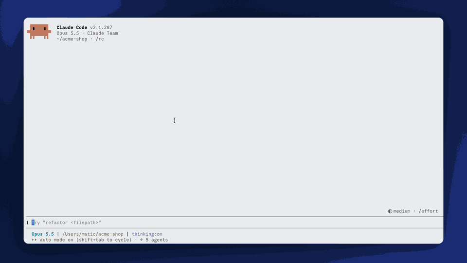

# linear-claude-mod

A [Claude Code mod](https://claude.dev/blog/getting-started-with-claude-code-mods/) that puts your assigned
Linear tickets in a pane. Open one to read it, and load it into your session when you're ready to work on it.

[](docs/demo.mp4)

- Tickets are grouped by status, most actionable first: In Progress, To Do, review/QA, Triage, Backlog.
  Within a status they sort by priority. Done and canceled tickets are hidden.
- Clicking a ticket shows its details and comments in the pane. Nothing is sent to Claude yet.
- **Work on this** (`w`) loads the ticket into your session: Claude reads it with the Linear tools,
  summarizes it, finds the relevant code and proposes a plan.
- Keys (pane focused): `1`–`9` open a ticket, `w` works on the open ticket, `o` opens it in Linear, `b` goes back to the list,
  `r` refreshes. The list also refreshes every 5 minutes.
- On a ticket: `c` writes a comment (Enter posts it), `m` opens a status picker with the team's
  workflow states, `p` opens a priority picker, and `x` cancels. The ticket and the list reload after
  each change. These need a surface with text fields, so the mobile app shows the ticket read-only.

Works in the terminal and the desktop app.

## Setup

You need a connected Linear MCP server, such as the official Linear plugin. The mod uses its
login, so there's no API key to set.

Load the mod in every session by adding it to `~/.claude/settings.json`, then restart Claude Code:

```json
{ "env": { "CLAUDE_CODE_PLUGIN_DIRS": "/path/to/linear-claude-mod" } }
```

Or for one session: `claude --plugin-dir /path/to/linear-claude-mod`.

Then type `/tickets`.

If your Linear MCP server isn't named `plugin:linear:linear` (check `/mcp`), set the `linearServer`
option in `/config`.

## Develop

```sh
claude plugin validate .
claude plugin test .
```

The code is in `hooks/`: `register.tsx` has the command and the pane, and `board.ts` has the sorting and
parsing helpers.

## License

MIT
